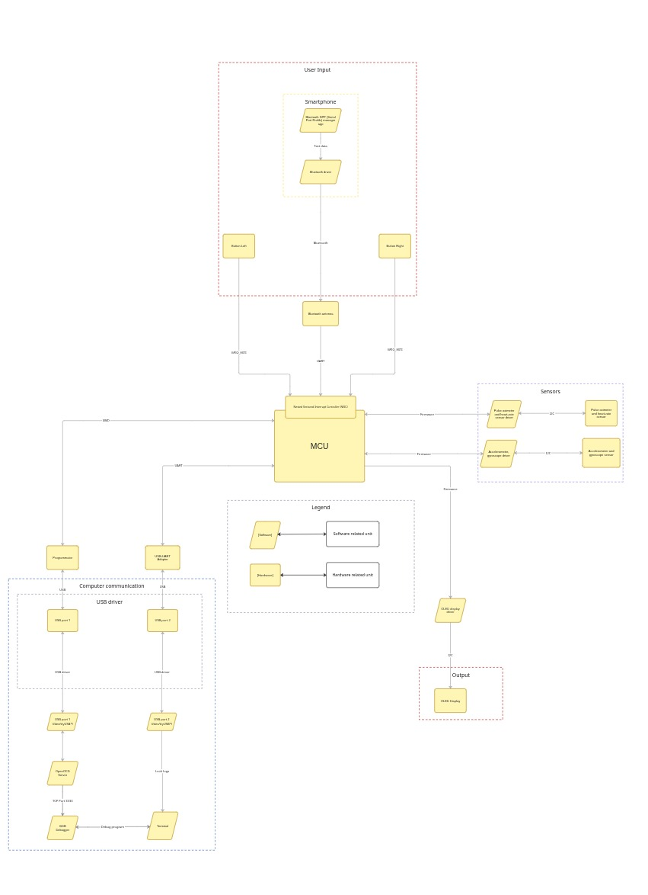

# Smart_watchesSTM32
My pet project of smart watches on STM32F103T8U6 MCU.

# Project state
Currently it's under development
# Hardware list
- STM32F103 (blue pill)
- Breadboard
- ST-Link V2
- OLED display ssd1306
- MAX30102 sensor
- MPU6050 GY-521 gyroscope & accelerometer
- HC-06 bluetooth antenna
- USB - UART adapter for debugging
- 2x buttons
- 2x 10k ohm resistor
# Driver for display
https://github.com/afiskon/stm32-ssd1306

# Driver for MAX30102
https://github.com/eepj/stm32-max30102/tree/master?tab=readme-ov-file

# Driver for MPU6050_GY-521
https://github.com/Ilyhadev/MPU6050_-GY-521-

# Features implented
- Added new font with russian text
- Implemented recognition of touch on sensor of MAX30102
- Implemented pulse finding algorithm for MAX30102
- Integrated self written driver for MPU6050 into code base
- Added bluetooth connection to smartwatches using HC-06
- Programmed HC-06 through AT commands (changed baud rate and name)
- Connected STM32 to debugging UART -> USB adapter to get data on PC from MCU
- Made RTC based clocks
- RTC gets data and time from parsed byted received from android phone through bluetooth
- Implemented menu navigation based on buttons (work on interruptions)

# Comprehensive diagram of project

For better quality please follow [this](https://miro.com/app/board/uXjVG1lzhco=/?share_link_id=381544303495) link on miro board.

# Functionality show
Check [this](https://drive.google.com/drive/folders/13SoW0XQsbWE5jTyACCuYr9KU23wv3TMS?usp=sharing) folder with 3 videos to see how project looks like:
- See bluetooth_communication.mp4 to see how smartphone communicates with Smartwatches
- See bpm_counting.mp4 to see capabilities of Smartwatches to count bpm
- See interface.mp4 to see how person can interact with  Smartwatches through button interface

# Features under development
- Step counting algorithm
- FreeRtos integration

# Future plans
- Interruptions for accelerometer (driver will be enhaced) and MAX30102
- Create own basic app on android to automatically pass data to HC-06
